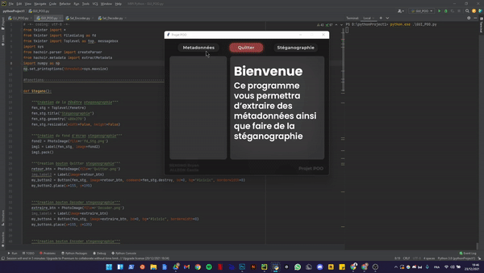
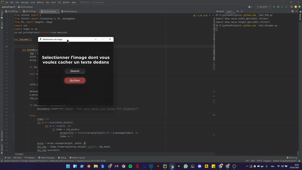
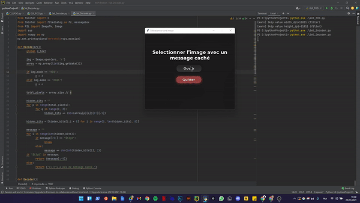

# Projet POO : Métadonnées et Stéganographie

#### Métadonnées en EXIF. Cacher une image dans un texte en utilisant la Stéganographie LSB ("Least Significant Bit")

## Binôme:
BEKONO ESSOMBA Bryan

ALLEON Gaelle

Groupe TD : E

N°10


  ## Contenu:
  
  Ce github contient :
  * 2 script python permettant de faire de la stéganographie et d'extraire les métadonnées d'une image.
  * Les doxyfiles de chaque scipts, pour la comprehension des fonctions.
  * Des images test pour faire de la steganographie et afficher les métadonnées.

    Le premier est le CLI "Command Line Interface", qui utilise des arguments 
    afin d'éxecuter les tâches demandées.

    Le second est le GUI "Graphical User Interface" fait sur tkinter, 
    c'est donc un programme qui a une interface graphique.
    
    ## Métadonnées GUI
    
    
    
    ## Encodage GUI
    
    
    
    ## Décodage GUI
    
    
  

  ## Modules:
  * sys
  * os
  * hachoir
  * tkinter
  * numpy

  ## Lancer les scripts
  ```
  python CLI_POO.py
  python GUI_POO.py
  python Sel_Encoder.py
  python Sel_Decoder.py
  ```
  
  
  ## Important:
  Pour que le GUI fonctionne il est important que ses images(boutons, fond d'écran etc) soit dans le même dossier que les scripts   GUI.


